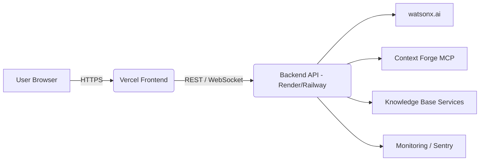

**Football Atlas — Production Deployment Guide**

Overview
--------
This document describes production deployment for Football Atlas. The target architecture is:

Frontend (React + Three.js)
  → Vercel (static hosting)

Backend (API + services)
  → Render / Railway / IBM Cloud (Docker deployment)

External services:
- IBM watsonx.ai (watsonx / Granite model)
- Context Forge MCP server
- Knowledge base services (Docling)

Architecture Diagram
--------------------

Environment variables (required)
--------------------------------
- `IBM_API_KEY` — watsonx IAM API key (must be a valid production key; placeholder or "mock" keys are rejected)
- `IBM_PROJECT_ID` — watsonx project id
- `IBM_GRANITE_MODEL` — model id (e.g., `ibm/granite-13b-chat-v2`)
- `IBM_BASE_URL` — watsonx base URL (region host)
- `MCP_SERVER_URL` — Context Forge MCP Server base URL
- `SENTRY_DSN` — (recommended) Sentry DSN for error monitoring
- `PORT` — backend listen port (default 3001)

Frontend-specific env (Vercel)
- `VITE_API_BASE_URL` — full backend base URL (e.g., `https://api.football-atlas.example`)
- `VITE_SENTRY_DSN` — optional for frontend error monitoring

Security
--------
- Do NOT commit secrets. Use platform secret management (Vercel environment variables, Render/Railway secrets, GitHub Actions secrets).

Health checks
-------------
- `GET /health` returns overall status including watsonx IAM check and MCP health probe. Returns 200 when OK, 503 when degraded.
- Configure platform liveness/readiness probes to call `/health`.

Monitoring and Observability
---------------------------
- Sentry for error tracking (backend & frontend). Provide `SENTRY_DSN`.
- Export `/api/metrics` for application metrics (Learning metrics already implemented).
- Recommend connecting platform logs to an aggregator (Datadog / LogDNA / Render logs).

CI/CD
-----
- GitHub Actions provided: builds frontend and deploys to Vercel, builds backend Docker image and pushes to GHCR.
- Configure Vercel project with `VERCEL_TOKEN`, `VERCEL_PROJECT_ID`, `VERCEL_ORG_ID` as GitHub secrets.
- Configure Render (or Railway) to deploy the backend from the `backend/Dockerfile` or the pushed GHCR image.

Rollback plan
-------------
1. If a deployment causes critical failures, use the hosting provider to roll back to the previous release (Vercel → revert to previous deployment; Render → rollback service #).  
2. Use GH Actions to re-deploy the previous tagged release (re-run workflow for tag).  
3. If database migration required, provide a migration rollback script and prevent automatic migrations on deploy.

Production validation checklist
------------------------------
- Open site in incognito and confirm landing loads < 3s.
- Ask a classroom question and verify watsonx returns explanation within 3s.
- Launch a concept and verify animation loads within 1.5s.
- Start audio commentary and verify startup latency < 500ms.
- Confirm `/health` shows all checks UP.

Next steps
----------
1. Provision production secrets in Vercel and Render/Railway.  
2. Create Render service (or Railway) using `backend/Dockerfile` or the GHCR image.  
3. Deploy frontend to Vercel using the provided GitHub Actions.  
4. Run the Production validation checklist and iterate.
