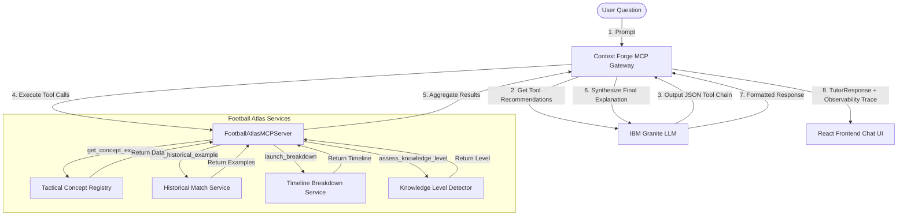

# Football Atlas ⚽🗺️

> **Every goal has a reason. See the logic behind the magic.**

Football Atlas bridges the gap between tactical theory, interactive 3D pitch visualizations, and grounded, evidence-backed historical match analysis. By integrating the **IBM Granite** reasoning engine and **IBM Docling** ingestion parser, it turns unstructured coaching literature into live, searchable, and interactive simulations.

---

## 🌟 The Hero Moment: The Face of Football Atlas

Before diving into schemas, APIs, or architectural block diagrams, Football Atlas establishes its identity through a single, iconic sporting moment.

### "Watch the moment Argentina lost control."

```
                     [ France Wins Ball ]  (Rabiot recovers possession)
                             │
                             ▼
                     [ Progress to Wing ]  (Pass to Mbappé wide; midfield fails to drop)
                             │
                             ▼
                     [ Midfield Disconnection ]  (Pass to Thuram; vertical gap opens in Zone 14)
                             │
                             ▼
                     [ Space Exploitation ]  (First-time wall pass return to Mbappé; Romero drawn out)
                             │
                             ▼
                     [ Mbappé Volley Equaliser ]  (France scores in three passes)
```

### The Target Demo Story
> **"Here's the exact moment Argentina's defensive shape broke down. Three passes before Mbappé's equaliser. Watch it happen."**

By centering the application's showcase around this 12-second sequence, a football fan immediately recognizes the legendary stakes of the 2022 FIFA World Cup Final, while a non-football fan instantly feels the breakdown of structure and vertical compactness.

---

## 📊 Candidate Evaluation Matrix

To select the face of Football Atlas, we compared multiple historical candidate moments across key pedagogical, visual, and narrative criteria:

| Candidate Moment | Visual Recognition | Tactical Causality | Spatial Complexity | Alignment with Value Proposition | Status / Justification |
| :--- | :---: | :---: | :---: | :---: | :--- |
| **Mbappé Equaliser vs. Argentina (2022)** | **Highest** (Billions of viewers) | **High** (Fatigue-induced line separation) | **High** (Rapid vertical lay-off + diagonal runs) | **Highest** (Explains "why" Argentina lost control) | **SELECTED HERO MOMENT**: Fully implemented in `HeroMomentMode` with custom coordinate simulation. |
| Messi vs. Netherlands Assist (2022) | High | Medium (Individual magic rather than collective failure) | Medium (Single line-breaking pass) | Medium (Focus is on individual technique) | Evaluated. Individual brilliance makes it harder to generalize tactical principles. |
| Liverpool vs. Barcelona "Corner Quickly" (2019) | High | Low (Sleepy defensive reaction, lack of structure) | Low (Simple set-piece distraction) | Low (Hard to extract general tactical concept) | Evaluated. Relies on defensive lapse rather than structural breakdown. |
| Spain vs. Italy (Euro 2012 Final) | Medium | High (Midfield overload and strikerless progression) | High (Slow possession circulation) | Medium (Lacks a single dramatic climax) | Evaluated. Lacks the instant narrative climax needed for the main landing page. |
| Barcelona vs. Manchester United (2009 Final) | High | High (Ferdinand drawn out by Messi False 9) | High (Winger diagonal inside runs) | High (Already implemented as standard False 9 breakdown) | Evaluated. Currently lives inside the Playbook under the False 9 concept lessons. |

---

## 🎨 Premium Visual Treatment: `HeroMomentMode`

When launching the Hero Moment, the system enters a specialized showcase state called **HeroMomentMode**:
*   **Archival Watermark & Scanlines**: The 3D pitch transitions into a desaturated archival aesthetic with subtle scanlines and an overlay grid.
*   **Custom Coordinate Simulations**: Direct Three.js-based rendering of the exact positions of Rabiot, Thuram, Mbappé, Romero, Enzo Fernández, and Rodrigo De Paul.
*   **IBM Granite Narration**: Rather than simple play-by-play comments (*"Mbappé scored"*), Granite explains **why** it happened: *"Argentina's midfield line became disconnected from the back line, creating the space France needed to progress."*
*   **Granular Step controls**: An interactive timeline allows judges, coaches, and users to scrub through the sequence pass-by-pass to analyze defensive line distortion.

---

## 🎭 Dual Audience Mode

Football Atlas serves multiple audiences. **A casual fan and a football student can ask the same question and each get exactly what they need.**

The same concept. The same 3D animation. Two completely different explanations.

### Audience Types

| Mode | Focus | Language |
|---|---|---|
| 🏟 **Fan View** | Stories, players, emotion, moments | Plain football language |
| 📐 **Tactical View** | Structure, space, decisions, transitions | Precise tactical vocabulary |

### Auto-Detection

Every question is analysed by the `AudienceDetectionEngine` — a zero-latency keyword classifier that detects the user's natural register:

**Casual Fan signals:** *"Why did Mbappé score?"*, *"How did France come back?"*, *"Who won the battle in midfield?"*

**Tactical Student signals:** *"How did the half-space collapse?"*, *"What structural weakness allowed the press to fail?"*, *"Describe the transition trigger."*

If confidence ≥ 60%, the mode is automatically switched. The **✦auto** label appears next to the toggle pill to indicate a detection occurred.

### Hero Moment Comparison: Mbappé Equaliser (2022 World Cup Final)

**🏟 Fan View:**
> *Kylian Mbappé looked like he had no chance. Argentina were 2-0 up in the World Cup Final with just over 20 minutes left. Then everything changed. A penalty. Mbappé stepped up and buried it — cool as you like. Within 97 seconds he scored again with a bicycle kick that left everyone stunned. That's the thing about Mbappé: defenders know what he can do, and he does it anyway.*

**📐 Tactical View:**
> *Mbappé's equaliser sequence exposed a structural fragility in Argentina's defensive shape. After the 80th-minute penalty, Argentina's back four dropped progressively deeper, conceding the half-spaces to Theo Hernandez. The bicycle kick arrived from a breakdown in Argentina's transition press — when Hernandez drove into the left channel, the Argentine midfield failed to collapse centrally. Mbappé exploited the gap between Otamendi and Molina in the right half-space, receiving a clipped cross behind the retreating defensive line. Key failure: Argentina stopped pressing triggers after 2-0, inviting France into a positional game they were structurally dominant in.*

### UI

The **audience toggle pill** (🏟 Fan / 📐 Tactical) sits in the Classroom Chat header. Clicking it manually switches the mode for all future responses. Each assistant bubble is stamped with a coloured badge (amber for Fan, sky for Tactical) so users can see at a glance which voice answered.

---

## 🏗️ System Architecture & Monorepo Layout

Football Atlas is structured as a TypeScript monorepo using standard package workspaces:

```
├── shared/                  # Shared Zod schemas, types, and concept seed definitions
├── backend/                 # Node.js/Express server containing Granite LLM prompts & Docling parser
│   ├── data/                # In-memory database JSON stores (concepts, matches, evidence)
│   └── src/                 # RAG ingestion pipelines and learning classrooms
└── frontend/                # Vite + React client containing Three.js visual language engine
    └── src/
        ├── conceptPackages/ # Register-on-demand tactical lessons
        ├── tacticalModules/ # Coordinate-based 3D player movements (e.g., ArgentinaFrance2022Module)
        └── pages/           # Premium glassmorphic pages (Dashboard, Explore)
```

### Key Technical Pillars
1.  **The Playbook**: A coordinate-based interactive canvas. It loads custom 3D animation scripts and maps tactical overlays (e.g., passing lanes, defensive lines, pressing traps) directly on the field.
2.  **The Classroom**: An AI-powered tutor terminal. Users ask questions, and **IBM Granite** responds with calibrated feedback matching the user's selected difficulty level, resolving pronouns, and automatically triggering corresponding 3D animations.
3.  **Docling Evidence Grounding**: Uploaded coaching guides are parsed by **IBM Docling**, segmented into semantic chunks, and cross-referenced. When viewing a breakdown, a slide-out **Evidence Panel** displays the raw excerpts to ground every tactical claim.

---

## 🛠️ MCP Agent Platform Architecture

Football Atlas uses the Model Context Protocol (MCP) to isolate the IBM Granite LLM from direct database access. Instead, Granite queries application services by executing typed MCP tools through the Context Forge gateway.



### Observability & Debug HUD
The platform tracks tool executions (latencies, inputs, status) in real time. These metrics are exposed:
- **In Classroom Chat**: Glowing execution tree traces printed under the assistant bubbles.
- **In HUD Debug Panel**: Dedicated **MCP Tools** tab listing active tool definitions and the runtime execution timeline.

---

## 🚀 Quick Start & Developer Instructions

### Prerequisites
Make sure you have [Node.js](https://nodejs.org/) (v18+) and `npm` installed.

### Installing Dependencies
Run the install command at the root of the workspace:
```bash
npm install
```

### Running Locally (Development Mode)
Start the concurrent backend and frontend dev servers:
```bash
npm run dev:all
```
*   **Frontend Client**: [http://localhost:5173](http://localhost:5173)
*   **Backend Server**: [http://localhost:3001](http://localhost:3001)

### Building the Project
Verify that all packages compile and bundle correctly:
```bash
npm run build:all
```

### Running Visual Language Tests
Validate the accessibility and rendering uniqueness of the tactical overlays:
```bash
npm run test:visual-language --workspace=frontend
```

---

## 📚 Technical Context & References
For developer deep-dives, refer to the following canonical documents:
*   [docs/MASTER_CONTEXT.md](file:///Users/sanjaywaradkar/Football_Atlas/docs/MASTER_CONTEXT.md): Entry point for codebase reference.
*   [docs/SYSTEM_ARCHITECTURE.md](file:///Users/sanjaywaradkar/Football_Atlas/docs/SYSTEM_ARCHITECTURE.md): Network request lifecycles and monorepo layers.
*   [docs/ANIMATION_SYSTEM.md](file:///Users/sanjaywaradkar/Football_Atlas/docs/ANIMATION_SYSTEM.md): Three.js timeline events and visual language signatures.
*   [docs/AI_SYSTEMS.md](file:///Users/sanjaywaradkar/Football_Atlas/docs/AI_SYSTEMS.md): Granite LLM schemas, intent mapping, and prompts.
