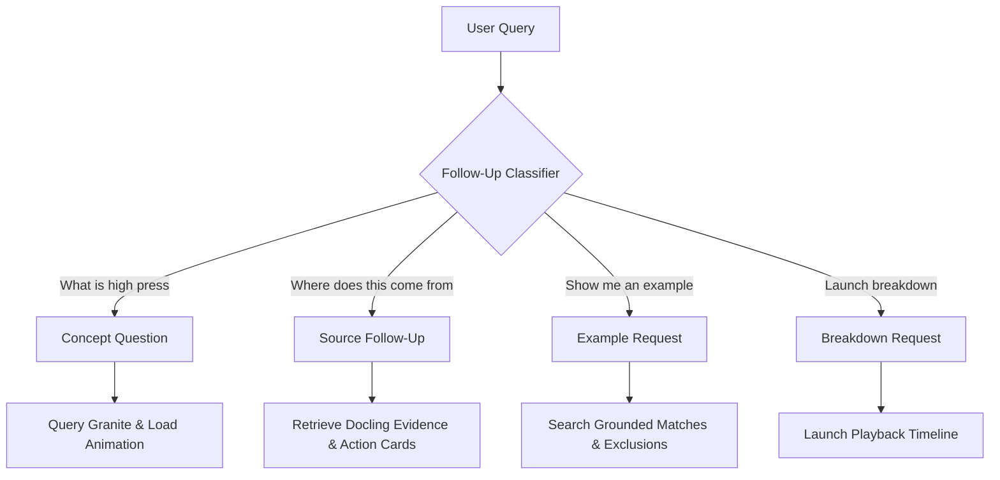

# AI Systems

Football Atlas integrates IBM Granite models to drive the Conversational Learning Classroom, adapting text generation, concept recognition, and visual actions to matches and user knowledge profiles.

---

## 1. Prompt Architecture

### System Prompt Construction
The system prompt is compiled dynamically for every request in [granite.service.ts](../backend/src/services/granite.service.ts). It incorporates:
1.  **Supported Concepts Vocabularies**: Generated dynamically from the registry keywords.
2.  **Conversational Session Context**: Active concept in play, previous concept history, active example, active breakdown, and the conversation summary.
3.  **Calibrated Knowledge Level**: The user's active level (`BEGINNER`, `INTERMEDIATE`, or `ADVANCED`).
4.  **Supporting Docling Evidence**: Matching document excerpts, titles, and types formatted as `SUPPORTING EVIDENCE FOR GROUNDING`.

### Level Calibration Templates
*   **Beginner Mode**: Simple, visual analogies (e.g. *decoy runner*, *magnets*), minimal terminology, no tactical jargon (forces model to avoid terms like *half-spaces*, *Zone 14*, *compactness*).
*   **Intermediate Mode**: Balanced tactical reasoning, visual movement flow, system shapes (e.g. *4-3-3*, *defensive block*), and midfield overload references.
*   **Advanced Mode**: Positional play details, defensive reference point manipulation, tactical tradeoffs, and specialized terminology (*half-spaces*, *Zone 14*, *compactness*, *overloads*).

---

## 2. Conversational Context & Memory

Memory and continuity are managed via the `SessionContext` database:

```typescript
export interface SessionContext {
  conversationId: string;
  context: ConversationContext;
  last_questions: string[];
  last_answers: string[];
  user_level: ComplexityLevel;
  served_example_ids: string[];
  knowledge_profile: {
    detected_level: ComplexityLevel;
    confidence_score: number;
    evidence: string[];
    conversation_history: string[];
  };
  conversation_thread: string[];
  last_concept: string | null;
  last_example: string | null;
  last_match: string | null;
  last_player: string | null;
  last_coach: string | null;
  last_breakdown: string | null;
  last_animation: string | null;
}
```

### Context Summarization
When session history depth exceeds **5 turns**, the orchestrator triggers the `conversationSummarizer` service. It instructs Granite to compile a condensed summary of key tactical themes discussed, saving token space in the context window.

---

## 3. Intent Routing & Follow-Up Intelligence



### Follow-Up Intent Types
*   **DIRECT_FOLLOWUP**: Query references the active concept (pronoun or follow-up question).
*   **CONCEPT_TRANSITION**: User requests a shift to a new concept.
*   **BREAKDOWN_REQUEST**: User requests an interactive 3D playback of a match moment.
*   **SOURCE_FOLLOWUP**: User asks for documentation proof (pattern matched using the compiled regex `/where did (you|that) (get|come from)|what source|show supporting evidence|.../i`).

### Reference Resolution (Pronoun Translation)
Resolves general nouns/pronouns (e.g., *"it"*, *"that play"*, *"she"*, *"the coach"*) by traversing session context parameters. For instance, if the active example is Barcelona 2009 and the user asks *"Why did he do that?"*, the system translates *"he"* to **Pep Guardiola** and *"that"* to the **False 9 dropping central**.

---

## 4. Grounding Integration Layer

When Granite generates an explanation, the backend verifies if grounded evidence is present.
1.  **Context Injection**: Chunks from `GroundedExampleService` are attached to the prompt system context.
2.  **Grounded Claims Enforcement**: Granite is explicitly instructed: *"When the CURRENT CONVERSATION CONTEXT contains SUPPORTING EVIDENCE, you MUST base your explanation on these sources. Prefer grounded claims referencing specific matches... Cite your sources inline, e.g. [Source Title]."*
3.  **Verification Check**: If the query is identified as a source follow-up, Granite bypasses LLM text generation and serves the structured Docling chunks with `VIEW_SOURCE` and `OPEN_EVIDENCE` card actions.
