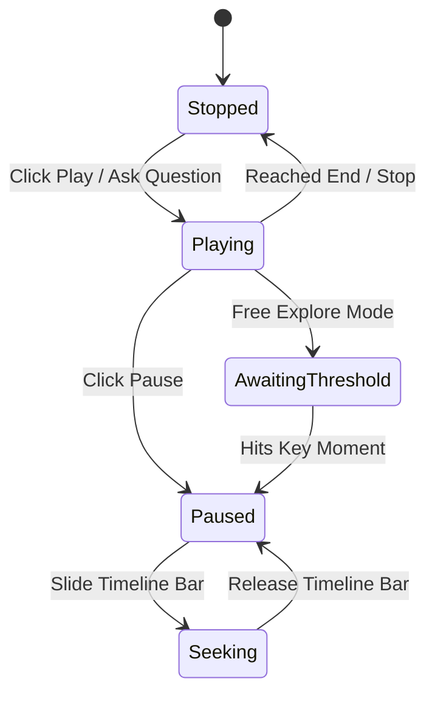

# Animation System

Football Atlas renders real-time, interactive 3D tactical animations on a simulated WebGL pitch canvas using Three.js and custom shaders.

---

## 1. WebGL Pitch & Render Loop

### Pitch Setup (`Pitch3D.tsx`)
The 3D pitch is set up as a perspective camera scene with directional and ambient lighting. Ground graphics, yard markings, and player coordinates are mapped to a local coordinate system where (0,0) represents the center circle. 

### Telemetry Ticker
The renderer runs a requestAnimationFrame loop, updating coordinate interpolation, checking keyframes, and publishing timeline updates to subscribers.
*   **Speed scale factors**: Supports variable speed playback (0.5x, 1x, 2x).
*   **Subscribers**: The active timeline synchronizes directly with Zustand stores to update HUD labels and phase annotations.

---

## 2. Dynamic 3D Shaders

Specialized shaders render visual effects for the Tactical Visual Language System (TVLS) in [overlay.ts](../frontend/src/tacticalEngine/overlay.ts):

| Shader Shader Name | Used For | Visual Representation | Key Parameters |
|:---|:---|:---|:---|
| `PULSE_RING` | `PRESS_TRIGGER` | Expanding concentric golden ripples | Radius, Ring Count, Pulse Speed |
| `VACATED_GLOW` | `SPACE_CREATION` | Shimmering vertical gold/amber cylinder | Height, Base Glow, Frequency |
| `COMPRESSION_BAND` | `DEFENSIVE_COMPACTNESS` | Compressing bands moving inward | Direction Vector, Speed, Thickness |
| `CONVERGING_ZONE` | `PRESSING_TRAP` | Multiple 3D cones narrowing on a player | Cones Array, Speed, Focus Radius |
| `FLASH_BURST` | `COUNTER_ATTACK_TRIGGER` | Instant gold screen-overlay flash | Decay, Intensity |

---

## 3. Visual Language event Signatures (TVLS)

Every tactical event has a consistent visual signature registered in [EventSignatureLibrary.ts](../frontend/src/visualLanguage/EventSignatureLibrary.ts):

```typescript
export interface VisualSignature {
  eventType: TacticalEventType;
  primaryColor: string;      // Canonical hex (e.g., gold #D4AF37 for historical mode)
  strokeWidth: number;
  dashStyle: 'solid' | 'dashed' | 'dotted';
  animationProfile: 'none' | 'pulse' | 'flow' | 'blink';
  accessibilityProfile: {
    shapeId: string;         // Unique non-color visual identifier (e.g. circles, cones, triangles)
    motionDescription: string;
    timingPattern: number[]; // Vibration/pulse intervals
  };
}
```

### The 13 Canonical Event Types
1.  **Press Trigger**: Expanding concentric pulse rings.
2.  **Passing Lane**: Glowing green solid connection channels.
3.  **Movement Run**: Dotted white arrows showing runs.
4.  **Third Man Run**: Sequential dashed arrows showing the off-ball runner pathway.
5.  **Zone Occupation**: Colored translucent ground zones.
6.  **Midfield Overload**: Translucent cluster circles.
7.  **Defensive Compactness**: Compressing boundary borders.
8.  **Defensive Line Drop**: Solid red boundary line receding backward.
9.  **Pressing Trap**: Converging cones targeting a receiver.
10. **Space Creation**: Shimmering vertical cylinders.
11. **Space Exploitation**: Flowing gold arrows traversing vacated zones.
12. **Transition Moment**: Screen-overlay flash of split field coordinates.
13. **Dynamic Cover Shadow**: Golden wedge overlay casting behind a pressing player.

---

## 4. Timeline Playback & Seeking

Animations support both **Guided Mode** and **Free Explore Mode**:



### Interpolation Math
Coordinates are stored as keyframe nodes. Player models interpolate between keyframes using cubic spline interpolation, ensuring smooth transitions when changing play speed or seeking.
*   **Guided Mode**: Continues running smoothly across phases, printing HUD instructions as thresholds are crossed.
*   **Free Explore Mode**: Automatically pauses the playhead when entering the next key moment, letting users manually inspect player coordinates.
