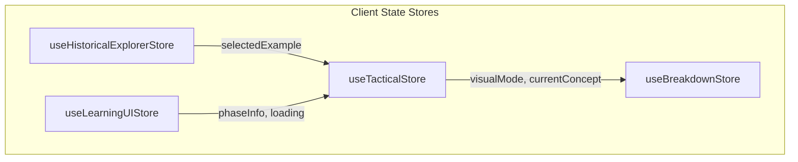

# Data Models & State Management

This document serves as the canonical schema and state store reference for Football Atlas.

---

## 1. Core Data Models

These TypeScript schemas are defined in `shared/src/types/` and validated using Zod schemas in `shared/src/schemas/`.

### TacticalConcept
Represents an abstract tactical concept in the playbook.
```typescript
export interface TacticalConcept {
  concept_id: string;
  concept_name: string;
  category: string;
  complexity: ComplexityLevel;
  core_explanation: string;
  key_principles: Array<{ title: string; description: string }>;
  related_concepts: string[];
  docling_chunks?: Array<{
    chunk_id: string;
    source_document: string;
    relevance_score: number;
  }>;
}
```

### HistoricalExample
Represents a real-world match example of a tactical concept.
```typescript
export interface HistoricalExample {
  example_id: string;
  concept_id: string;
  match_name: string;
  coach: string;
  season: string;
  competition: string;
  teams: string[];
  players: string[];
  description: string;
  tactical_summary: string;
  beginner_friendly: boolean;
  confidence_rating: number;
}
```

### HistoricalEvidence
Represents a Docling chunk mapped as supporting evidence for a match example.
```typescript
export interface HistoricalEvidence {
  evidence_id: string;
  example_id: string;
  document_id: string;
  chunk_id: string;
  source_title: string;
  source_type: string;
  coach: string;
  season: string;
  excerpt: string;
  confidence: number;
}
```

### HistoricalBreakdown & BreakdownMoment
Defines key moments and playback camera coordinates for match simulations.
```typescript
export interface BreakdownMoment {
  moment_id: string;
  timestamp: number;        // Fraction 0.0 - 1.0 of the timeline
  title: string;
  annotation: string;
  camera_view: 'overview' | 'player_focus' | 'tactical_shape' | 'passing_lane' | 'space_creation';
}

export interface HistoricalBreakdown {
  breakdown_id: string;
  example_id: string;
  title: string;
  description: string;
  key_moments: BreakdownMoment[];
}
```

### ConversationContext
Tracks session variables in the memory layer.
```typescript
export interface ConversationContext {
  active_concept: string | null;
  previous_concepts: string[];
  conversation_summary: string | null;
  active_example: string | null;
  active_breakdown: string | null;
}
```

---

## 2. Frontend State Stores (Zustand)



### 1. `useTacticalStore`
*   **Purpose**: Manages general playbook state, active evidence, and conversation turns.
*   **State Variables**:
    *   `concepts`: List of loaded concepts.
    *   `conversation`: Array of `ConversationTurn` logs.
    *   `detectedLevel`: Calibrated complexity (`BEGINNER`, `INTERMEDIATE`, `ADVANCED`).
    *   `visualMode`: Pitch presentation state (`concept` or `historical`).
    *   `activeEvidence`: Aggregated list of supporting `HistoricalEvidence` matches.
    *   `isEvidencePanelOpen`: Control variable for sliding the Evidence Panel open.
*   **Actions**:
    *   `fetchEvidenceForExample(exampleId)`: Queries backend endpoint and populates `activeEvidence`.
    *   `setVisualMode(mode)`: Switches layouts and sets Three.js color saturation.

### 2. `useBreakdownStore`
*   **Purpose**: Manages playback parameters for historical match breakdowns.
*   **State Variables**:
    *   `currentBreakdown`: Active breakdown config.
    *   `currentMomentIndex`: Active moment step.
    *   `timelineProgress`: Float position (0.0 to 1.0) of playback.
    *   `playbackState`: Status (`playing`, `paused`, `stopped`).
*   **Actions**:
    *   `startBreakdown(example)`: Loads matching breakdown and switches visual mode to `historical`.
    *   `setMoment(index)`: Seeks playhead to target timestamp and resets the camera preset.

### 3. `useHistoricalExplorerStore`
*   **Purpose**: Manages sorting and filter states inside the Match Explorer list.
*   **State Variables**:
    *   `selectedExample`: Current example selected by user.
    *   `activeFilters`: Fields for sorting matches by Competition, Coach, Player, or Season.

### 4. `useLearningUIStore`
*   **Purpose**: Manages visual phase annotations and layout load states.
