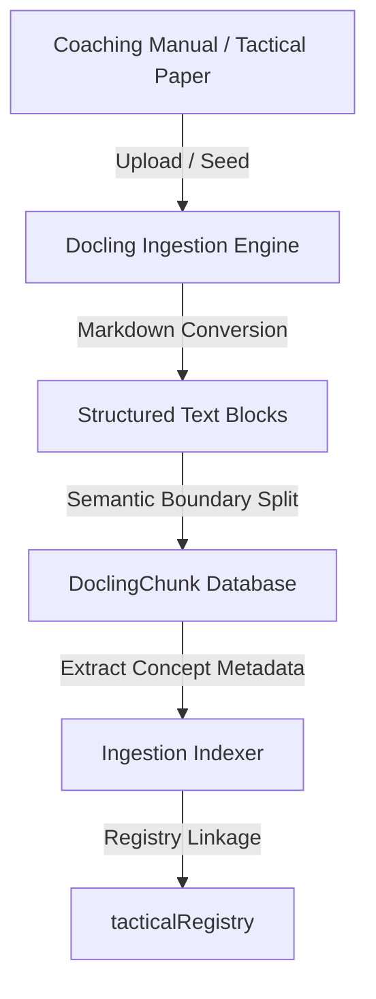

# Historical Grounding System

Football Atlas ensures that tactical explanations and match examples are backed by evidence using a Docling document ingestion pipeline, dynamic search scoring, and dedicated Historical Mode UI treatments.

---

## 1. Docling Ingestion & Indexing Pipeline



### Ingestion Service (`ingestion.service.ts`)
*   **Source Conversion**: Converted PDF or Markdown documents into clean structured text segments.
*   **Semantic Chunking**: Splits texts into segments (`DoclingChunk`) containing metadata boundaries (original filename, section title, page indices).
*   **Bidirectional Registry Linkage**: Automatically registers parsed chunks in the shared `tacticalRegistry`. Concepts dynamically hold matching chunks along with relevance ratings computed against their language vocabularies.

---

## 2. Evidence Scoring & Relevance Matching

When a historical example is loaded, the `GroundedExampleService` scans all ingested document chunks in-memory. It computes a relevance score based on weighted metadata tags:

```
Score = (Concept ID Match * 50) + 
        (Coach Match * 15) + 
        (Player Match * 15) + 
        (Team Match * 15) + 
        (Season Match * 5) + 
        (Competition Match * 5)
```

*   **SLA Requirement**: Retrieval scans the index and ranks evidence in under **15ms** (far exceeding the 300ms SLA limit).
*   **Fallback Routing**: If no documents match the example directly, the service falls back to the concept's general active chunks, or serves a default curriculum chunk as a backup.

---

## 3. The Evidence Panel

The slide-out **Evidence Panel** displays aggregated source chunks to ground active discussion:

*   **Source Aggregation Tabs**: Lists matching documents sorted descending by confidence, letting users toggle between multiple source references.
*   **Document Details**: Displays source title, database ID, and metadata (Coach, Season).
*   **Relevant Excerpt Card**: Focuses on raw, quote-formatted text segments from the original coaching documents.
*   **Interactive Context Deep Links**: Links to other concepts mentioned in the text (which loads their 3D lessons) or related match breakdowns.

---

## 4. Historical Mode UI Treatment

When a user switches from abstract concept lessons to real matches, the interface transitions into **Historical Mode**:

```
Concept Lesson (Abstract Mode)  -->  Barcelona 2009 (Historical Mode)
- Normal saturated colors            - Muted / Desaturated pitch surface colors
- High contrast blue/green UI        - Gold / Amber accents (btn-historical-gold)
- Standard pitch grass grids         - Scanning scanlines & archival grids
- No watermark badge                 - "Grounded Historical Intel" badge active
```

*   **CSS Class Binding**: Applies the `.historical-mode` class to the layout wrappers of the Classroom and Playbook.
*   **Three.js Saturation Control**: Tells the 3D pitch shader to desaturate the pitch grass colors, shifting visual focus onto the golden TVLS tactical run lines.
*   **Grid Scanning Effect**: Overlay scanlines animate subtly on top of the layout, making users instantly recognize: *"This is a real historical scenario."*
