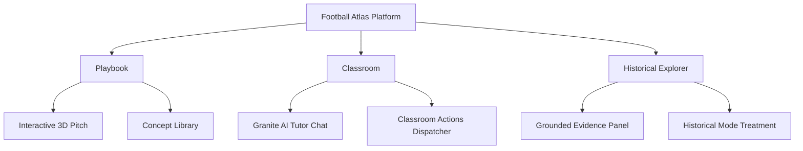

# Football Atlas - Master Context Reference

Welcome to the **Football Atlas Canonical Project Reference**. This documentation package is designed to provide a comprehensive, developer-ready, and agent-readable guide to the architecture, services, data models, and visual/intelligence layers of the Football Atlas platform.

---

## 1. Project Vision & Philosophy

### What is Football Atlas?
Football Atlas is a state-of-the-art tactical education platform that demystifies football concepts using a bidirectional connection between theory, interactive 3D visualizations, and grounded real-world historical matches. 

### Target Audience
*   **Tactical Enthusiasts & Students**: Users looking to understand complex positional concepts (e.g., False 9, Midfield Overloads) through interactive instruction.
*   **Coaches & Analysts**: Professionals seeking a pedagogical sandbox to visualize tactical setups and reference historical case studies.
*   **Maintainers & AI Agents**: Developers and LLM subagents looking to safely extend the concepts, animations, and grounding documents.

### Core Philosophy: "Tactical Grounding"
Standard football discussions are often plagued by hand-waving claims. Football Atlas operates on the strict philosophy of **Tactical Grounding**: every tactical concept and analyzed match must be traceable back to documented evidence (coaching licenses, tactical whitepapers, and national curricula) ingested through IBM Docling and structured by IBM Granite.

---

## 2. Product Pillars

### Pillar I: The Playbook
The Playbook serves as an interactive manual. It houses the **Concept Library** (explaining the core 10 concepts) and provides controls to play, pause, seek, and toggle visual overlays (e.g., passing lanes, pressing zones) on an interactive 3D tactical board.

### Pillar II: The Classroom
The Classroom matches conversational learning with 3D pitch animations. Powered by IBM Granite, users ask natural language questions (e.g., *"Why is a False 9 hard to defend?"*). Granite detects the complexity level of the query, drafts a calibrated explanation, resolves pronouns, and triggers actions like playing animations, recommending next steps, or loading match breakdowns.

### Pillar III: Grounded Historical Intelligence
Every analysis is backed by **Docling** source materials. When a user asks *"Where does this analysis come from?"*, the system reveals matching document chunks, showing raw excerpts, document details, and match metadata via a slide-out **Evidence Panel**. When viewing historical examples, the interface transitions into **Historical Mode**—styling the pitch with sepia desaturation, scanning grids, and an archival watermark.

---

## 3. Documentation Map (Canonical Registry)

Click the links below to explore specific layers of the system:

1.  **[SYSTEM_ARCHITECTURE.md](SYSTEM_ARCHITECTURE.md)**: Details the high-level monorepo layout, request lifecycles, data flows, and subsystem components.
2.  **[AI_SYSTEMS.md](AI_SYSTEMS.md)**: Documents IBM Granite integrations, prompt configurations, complexity detection, reference resolution, and follow-up intent flows.
3.  **[ANIMATION_SYSTEM.md](ANIMATION_SYSTEM.md)**: Explains Three.js runtime primitives, the visual language event registry, overlay shaders, and timeline progression.
4.  **[HISTORICAL_SYSTEM.md](HISTORICAL_SYSTEM.md)**: Focuses on the Docling chunk ingestion pipeline, relevance scoring, the Evidence Panel, and Historical Mode UI treatments.
5.  **[DATA_MODELS.md](DATA_MODELS.md)**: Serves as the schema reference for Concepts, Matches, Evidence, Context, and State Management.
6.  **[DEVELOPER_GUIDE.md](DEVELOPER_GUIDE.md)**: A step-by-step developer tutorial showing how to add concepts, register animations, ingest documents, and extend Granite keywords.
7.  **[TESTING_GUIDE.md](TESTING_GUIDE.md)**: Explains verification test suites, latency audits, and regression regression workflows.
8.  **[ADR.md](ADR.md)**: Architectural Decision Records outlining why the system is designed the way it is (e.g., self-registering modules, in-memory chunk indexes).
