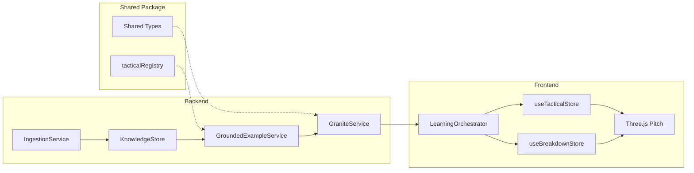

# System Architecture

This document maps out the high-level architecture, service interactions, data flow, and components of Football Atlas.

---

## 1. Monorepo Structural Division

Football Atlas is structured as a TypeScript monorepo using npm Workspaces:

```
Football_Atlas/
├── shared/             # Type contracts, schemas, and concept registries
├── backend/            # Express REST API and Granite/Docling services
└── frontend/           # React, Zustand stores, and Three.js 3D Pitch canvas
```

### The Shared Package (`shared`)
Houses shared validation contracts and metadata registries.
*   **Concept Registry**: Houses static concept listings and definitions.
*   **Zod Validation Schemas**: Ensures structural alignment for request bodies, historical data, and evidence records before they traverse system boundaries.

### The Backend (`backend`)
Acts as the intelligence orchestrator. Exposes Express routes, interacts with Watsonx/HuggingFace APIs for Granite text generation, processes ingested files via Docling chunking, and maintains the persistent knowledge store.

### The Frontend (`frontend`)
Handles presentation and user interaction. Renders the interactive Three.js pitch, maintains client-side stores (Zustand), updates visual elements (TVLS), and displays conversational tutoring threads.

---

## 2. Request Lifecycle & Conversational Loop

When a user interacts with the Classroom interface, the request flows through the system as follows:

```mermaid
sequenceDiagram
    autonumber
    actor User as User Chat
    participant UI as ConversationalLearningInterface
    participant Store as Zustand (useTacticalStore)
    participant Orch as LearningOrchestrator
    participant API as Backend (granite.service)
    participant Intent as ClassroomIntentEngine
    participant DB as KnowledgeStore / GroundedExampleService
    participant LLM as IBM Granite (Watsonx API)

    User->>UI: Types: "Why is a False 9 hard to defend?"
    UI->>Store: askQuestion(prompt)
    Store->>Orch: askQuestion(prompt)
    Orch->>API: POST /api/tactical/tutor { prompt, history }
    
    rect rgb(20, 30, 45)
        note right of API: Backend Processing
        API->>Intent: evaluate(prompt) (Resolves context & pronouns)
        API->>DB: getEvidenceForExample(activeExampleId) (Fetches relevant Docling chunks)
        API->>LLM: POST /chat/completions (Injected with context + evidence)
        LLM-->>API: Returns formatted JSON
        API-->>Orch: Returns TutorResponse
    end
    
    Orch->>Store: Append assistant turn & detected level
    Orch->>Store: setVisualMode('concept') or setVisualMode('historical')
    Orch->>UI: Render message bubble + action buttons
    Store->>DB: Fetch evidence if VIEW_SOURCE clicked
    DB-->>Store: Set activeEvidence
    Store->>UI: Slide out Evidence Panel
```



---

## 3. Subsystem Breakdown

### 1. Ingestion & Retrieval Pipeline (Docling)
*   Ingests PDF/Markdown documentation in [backend/src/documents](../backend/src/documents).
*   Splits files into structured chunks (`ChunkRecord`) via [ingestion.service.ts](../backend/src/services/ingestion.service.ts).
*   Scores chunks in-memory against concept vocabularies.
*   Links matching chunks bidirectionally to the `tacticalRegistry` in the shared namespace.

### 2. Conversational Intent Engine (Granite)
*   **Knowledge Level Detector**: Tracks user profile complexity (Beginner, Intermediate, Advanced) based on question complexity, adaptively adjusting grammar and terminology.
*   **Reference Resolver**: Translates pronouns (*"it"*, *"that setup"*) to active tactical components using conversation logs.
*   **Follow-Up Intent Engine**: Classifies user queries into transition intents (e.g. concept shifting, breakdown launching, source follow-up checks).

### 3. Interactive 3D Pitch Canvas (Three.js)
*   **TacticalAnimationEngine**: Handles the Three.js render loop, camera setups, and light sources.
*   **composedModule.ts**: Compiles animation phases, mapping coordinate nodes to Three.js meshes.
*   **Visual Language Registry (TVLS)**: Applies stylistic layers (stroke widths, animation speeds, dash spacing) based on active concept requirements.

### 4. Grounded Example Services
*   **GroundedExampleService**: Matches example players and coaches against Docling document indexes, computing confidence metrics.
*   **Historical Mode**: Desaturates colors and applies scanlines to make historical situations visually distinct from abstract concepts.

---

## 4. Cross-System Dependencies


