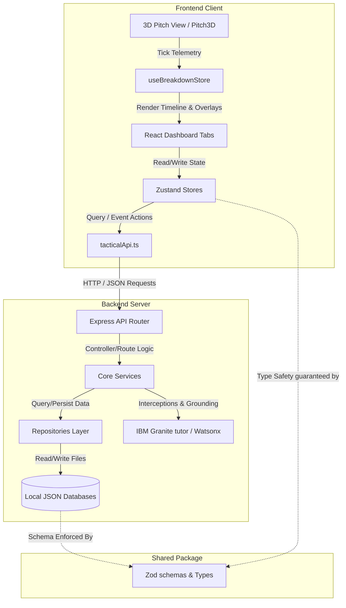

# Football Atlas: Comprehensive Platform Documentation

Welcome to the central architectural documentation of **Football Atlas**, an AI-powered interactive tactical tutoring platform. 

This document serves as the single source of truth for the platform's monorepo structure, detailing the database schema contracts, 3D WebGL pitch engine, dynamic animation modules, historical breakdown runtime, AI tutor integrations, and the guided progression mechanics.

---

## 1. Product Overview & Architecture

Football Atlas is structured as a TypeScript/React monorepo, divided into three specialized packages:
1.  **Shared Contract (`shared/`)**: Shared TypeScript interfaces, enums, and Zod validation schemas. Defines the data contract between frontend and backend.
2.  **Backend Server (`backend/`)**: Node.js/Express service layer wrapping vector retrievals, file-based database repositories, JSON stores, and connections to the IBM Granite LLM.
3.  **Frontend Client (`frontend/`)**: React app powered by Three.js (WebGL 3D Pitch engine), Zustand stores, and modern CSS layouts.

### High-Level Architectural Flow



---

## 2. Shared Library & Data Models (`shared/`)

The shared library contains data validators and contract enums. This package is built with standard TypeScript `tsc` and compiled before the backend and frontend packages.

### 2.1 Enums (`src/enums/tactical.enums.ts`)
Three primary enums classify the data structures:
*   `TacticalCategory`: Groups tactical topics. Values: `ATTACKING_SHAPE`, `DEFENSIVE_SHAPE`, `TRANSITION`, `PRESSING`, `FORMATION`, `SPATIAL_CONTROL`.
*   `ComplexityLevel`: Rates lesson difficulty. Values: `BEGINNER`, `INTERMEDIATE`, `ADVANCED`.
*   `RequiredOverlay`: Denotes 3D renderer overlays. Values: `PASSING_LANES`, `PRESSING_ZONES`, `MOVEMENT_ARROWS`, `SPACE_CONTROL`, `DEFENSIVE_LINES`.

### 2.2 Schemas & Types
Zod schemas run parsing and validation at runtime. Core schemas include:

| Schema Name | Target Interface | Purpose |
| :--- | :--- | :--- |
| `TacticalConceptSchema` | `TacticalConcept` | Represents a core tactical subject (e.g. *False 9*, *High Press*) with keys, defensive counter-measures, video URLs, and related concepts. |
| `HistoricalMatchSchema` | `HistoricalMatch` | Matches a real-world example from history (e.g. Pep's Real Madrid vs Barcelona 2009) to a concept. |
| `HistoricalBreakdownSchema`| `HistoricalBreakdown`| Detailed timeline moments containing text commentary, overlays, and camera angle coordinates. |
| `LearnerProfileSchema` | `LearnerProfile` | Represents user progress, study duration, unlocked items, difficulty level, and active paths. |
| `ConceptMasterySchema` | `ConceptMastery` | Progression scores ($0-100\%$) and confidence tracking for each concept. |
| `LearningPathSchema` | `LearningPath` | Predefined path objects with ordered lessons, estimated times, and requirements. |

---

## 3. Core 3D Pitch Engine & Animation Runtime

The visual heart of Football Atlas is the interactive 3D tactical pitch, designed using React and Vanilla Three.js to render player entities, ball physics, and overlay graphics.

### 3.1 WebGL Pitch Renderer (`Pitch3D.tsx` & `usePitchEngine.ts`)
*   **3D Camera & Scene Setup**: Implements standard perspective projection cameras, soft shadow directional lighting, and OrbitControls for rotation and zooming.
*   **Off-Screen Thread Optimization**: Binds coordinate matrices and ticks inside a `requestAnimationFrame` loop, rendering at 60fps.
*   **Camera Presets**: The pitch controller can slide coordinates dynamically to preset views:
    *   `overview`: Standard high, wide bird's-eye view.
    *   `player_focus`: Tight, angled follow-cam tracking a ball carrier.
    *   `tactical_shape`: Vertical look highlighting spacing of defensive lines.
    *   `passing_lane`: Angled low-cam looking through passing channels.

### 3.2 Tactical Primitive Library
Custom graphics are drawn using vector math and shader meshes:
*   **Passing Lanes**: Segmented pulsing dotted lines drawn using Bezier curves with varying opacity to show passing paths.
*   **Pressing Zones**: Transparent red radial polygons mapped to the pitch grid, highlighting areas of high defensive pressure.
*   **Movement Arrows**: Dynamic arrow vectors featuring custom arrowhead geometry, showing runs off the ball.
*   **Space Control**: Heatmap contours (Voronoi region meshes) visualizing areas of space dominated by individual players or lines.

### 3.3 Self-Registering Concept Packages
To scale to hundreds of concepts, Football Atlas uses a modular concept package runtime:
1.  **Index Registration**: Concepts are exported via a manifest.
2.  **ConceptManifest**: Defines learning goals, estimated time, vocabulary keywords, and animation details.
3.  **ModuleClass**: The class containing instructions to animate player entities.
4.  **LessonDefinition**: Timeline phases that map step-by-step progress to phase titles and instructions.

### 3.4 Runtime Orchestrator & Loader
*   `ConceptLoader`: Detects package files, validates their JSON manifests against schemas, and registers them.
*   `ConceptGraph`: Builds a directed graph of relationships:
    ```
    [Compactness] ───> [Midfield Overload] ───> [Third Man Run]
    ```
*   `learningOrchestrator`: Starts and stops animations, handles play/pause triggers, coordinates playback speeds ($0.5\text{x}$ to $2\text{x}$), and dispatches progress updates to the active UI state.

---

## 4. Historical Example Explorer & Breakdowns

Matches and examples are modeled as interactive tactical breakdowns rather than static videos.

### 4.1 Match Database & Exploration
The platform hosts a dataset of matches inside the database directory. Users can search and filter these matches in the `HistoricalExampleExplorer` using three dimensions:
*   **Category**: Attacking, Pressing, Defensive shape.
*   **Coaches**: Pep Guardiola, Jürgen Klopp, José Mourinho, Diego Simeone, etc.
*   **Text Query**: Searches match names, seasons, and player names.

### 4.2 Interactive Breakdown Mode
When a learner launches a breakdown, the interface enters a high-fidelity analysis layout:
*   **Split Pitch/Sidebar Layout**: The 3D pitch becomes primary. The Concept Inspector is replaced by the Breakdown Timeline.
*   **Synchronized Timeline Moments**: As the sequence ticks, it matches moment thresholds:
    ```
    Moment 0: Initial Lineup (0%) ───> Moment 1: Messi Drops Deep (25%) ───> Moment 2: Cannavaro Pulled Out (55%)
    ```
*   **Analysis Modes**:
    *   **Guided Play**: Runs smoothly from start to finish, triggering camera angle shifts and Granite narrations automatically.
    *   **Free Explore**: Automatically pauses at each moment marker, allowing the user to rotate, zoom, and inspect overlays manually.
*   **Granite Narrative Grounding**: Displays commentary synchronized to the active frame, explaining *why* the shape shifted and *who* triggered the movement.

---

## 5. Learning Journey System

The Learning Journey System provides guided progression, transforming individual lessons into a structured curriculum.

### 5.1 Learner Profile & Concept Mastery Model
Progress is tracked across multiple fields:
```typescript
interface LearnerProfile {
  userId: string;
  completed_concepts: string[];
  completed_breakdowns: string[];
  learning_time: number;
  difficulty_level: 'beginner' | 'intermediate' | 'advanced';
  active_path_id: string | null;
  started_paths: Record<string, string>;
  completed_paths: Record<string, string>;
}
```
Each concept features a `ConceptMastery` progress score:
$$\text{Completion Percentage} = \begin{cases} 100\% & \text{if Playbook core lesson completed} \\ 0\% & \text{otherwise} \end{cases}$$
$$\text{Confidence Score} = \min\left(100\%, \quad (N_{\text{breakdowns}} \times 25\%) + (N_{\text{questions}} \times 5\%)\right)$$

### 5.2 Curated Learning Paths
The server seeds 7 curriculum paths:
1.  **Beginner Football IQ**: Concepts: `defensive_block`, `high_press`, `counter_attack_trigger`.
2.  **Pressing Systems**: Concepts: `high_press`, `pressing_trap`, `compactness_pressing_lines`.
3.  **Positional Play**: Concepts: `midfield_overload`, `false_9`, `third_man_run`.
4.  **Modern Attacking Football**: Concepts: `inverted_winger`, `third_man_run`, `counter_attack_trigger`.
5.  **Defensive Organization**: Concepts: `defensive_block`, `compactness_pressing_lines`, `pressing_trap`.
6.  **Guardiola Principles**: Concepts: `false_9`, `midfield_overload`, `third_man_run`.
7.  **Klopp Principles**: Concepts: `high_press`, `pressing_trap`, `counter_attack_trigger`.

### 5.3 Prerequisite Recommendations
The backend recommendation engine resolves next steps using a prerequisite graph:
*   A concept remains **Locked** until its prerequisites are completed.
*   If a concept has unmet prerequisites, the engine recommends studying the prerequisite first (e.g. recommending `high_press` before unlocking `pressing_trap`).

```
Locked Target: [Pressing Trap]
   ├── Completed: [High Press] ✓
   └── Unmet: [Compactness & Pressing Lines] ──> Recommendation Engine suggests this next
```

### 5.4 FotMob-Inspired Journey Dashboard
Renders as a dashboard tab:
*   **Header Stats**: Displays metrics (Active Mins, Mastered Count, Path, Breakdowns Completed).
*   **Recommended Next Step Card**: Spotlight banner guiding the user to their next lesson or match breakdown.
*   **Paths Grid**: Visual cards displaying progress bars, completion ticks, and activation triggers for the 7 paths.
*   **Mastery Board**: Lists all 10 concepts with circular progress gauges and confidence ratings.
*   **Activity Logs**: Real-time audit trail displaying recent learning events.

---

## 6. Classroom Chat & AI Integration (IBM Granite)

The platform features a Conversational Learning Interface powered by IBM Granite.

### 6.1 Conversational Learning Interface
*   **Text Console**: A chat console where users can ask questions about match animations or general football tactics.
*   **Visual Grounding**: Granite is aware of the active 3D pitch scenario. If the user asks *"What's happening here?"*, the context includes coordinates and player states.
*   **Dynamic Keyword Triggering**: Extracts key concepts from chat prompts to suggest follow-up questions and related lessons.

### 6.2 AI Tutor Contextual Interceptor
The tutor intercepts progression-related queries (e.g. *"What should I learn next?"*, *"Recommend a lesson"*):
1.  **State Lookup**: Queries the active learner profile, mastery lists, and paths.
2.  **Recommendation Injection**: Calls the recommendation service to get the next recommended concept, example, and breakdown.
3.  **Prompt Compiling**: Feeds the details into the LLM system instructions:
    ```
    [System Context]
    You are the Granite Football Tutor. The user has completed [False 9] and is currently on the [Positional Play] path.
    The next recommended concept is [Midfield Overload] because [False 9 movement creates central overloads].
    Formulate a natural, conversational response suggesting this next step.
    ```
4.  **Generative Guide**: Returns a personalized response that aligns the user's progress with their curriculum.

---

## 7. Storage, Routing, & monorepo Details

### 7.1 Workspace Packages
The monorepo structure is defined in the root `package.json` workspaces:
```json
"workspaces": [
  "shared",
  "backend",
  "frontend"
]
```

### 7.2 Persistence Layers
All databases are persisted as JSON files within the backend's data folder:
*   `backend/data/learner_profiles.json`: Stores user progression state.
*   `backend/data/concept_masteries.json`: Stores concept mastery scores.
*   `backend/data/historical_breakdowns.json`: Pre-seeded match sequence timeline details.
*   `backend/data/learning_paths.json`: Curriculum path seeds.

### 7.3 Routes Mapping

```
GET  /api/tactical/journey/profile          --> Load active LearnerProfile
POST /api/tactical/journey/profile          --> Save/Update LearnerProfile
GET  /api/tactical/journey/mastery          --> Load ConceptMastery list
GET  /api/tactical/journey/paths            --> Load seeded LearningPaths
GET  /api/tactical/journey/recommendations  --> Generate next concept, breakdown, and example
POST /api/tactical/journey/track-event      --> Logs activities and triggers mastery recalculations
```
